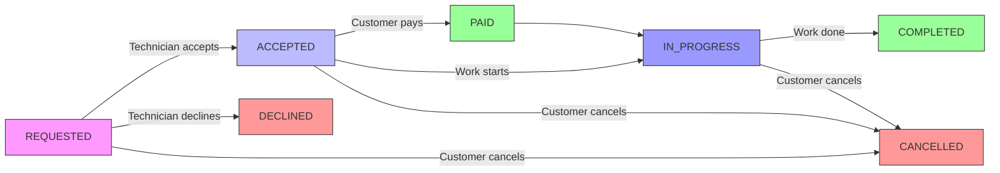

# FixItNow API Documentation
Compatible with Postman Import

Base URL: `http://localhost:5000/api` (adjust for your environment)
Authentication: JWT via `Authorization: Bearer <token>` or HttpOnly cookies
Content-Type: `application/json` for all requests/responses

## 📑 Table of Contents
* [Authentication](#authentication)
* [Bookings](#bookings)
* [Categories](#categories)
* [Customers](#customers)
* [Payments](#payments)
* [Services](#services)
* [Technicians](#technicians)
* [Notes](#notes)

## 🔐 Authentication
Endpoints under `/api/auth`

### Register User
`POST /register`
Create new customer or technician account

| Parameter       | Type   | Required | Description                      |
| --------------- | ------ | -------- | -------------------------------- |
| name            | string | ✅        | Full name                        |
| email           | string | ✅        | Unique email address             |
| password        | string | ✅        | Min 8 characters                 |
| phone           | string | ❌        | Contact number                   |
| role            | enum   | ✅        | CUSTOMER or TECHNICIAN           |
| profilePhoto    | string | ❌        | URL to profile image             |
| bio             | string | ❌        | Professional bio (techs only)    |
| yearsExperience | number | ❌        | Years of experience (techs only) |
| hourlyRate      | number | ❌        | Hourly rate (techs only)         |

**Example Request**
```json
POST /api/auth/register
{
  "name": "John Doe",
  "email": "john@example.com",
  "password": "SecurePass123!",
  "phone": "+8801234567890",
  "role": "CUSTOMER",
  "bio": "Homeowner seeking reliable services",
  "yearsExperience": 0,
  "hourlyRate": 0
}
```

**Success Response (201 Created)**
```json
{
  "success": true,
  "statusCode": 201,
  "message": "User is successfully registered!",
  "data": {
    "id": "usr_abc123",
    "name": "John Doe",
    "email": "john@example.com",
    "role": "CUSTOMER"
  }
}
```

**Error Responses**
* `400`: User with this email already exists
* `400`: Role must be either CUSTOMER or TECHNICIAN
* `400`: Validation failed on [field]

### Login User
`POST /login`
Authenticate and receive JWT tokens

| Parameter | Type   | Required | Description      |
| --------- | ------ | -------- | ---------------- |
| email     | string | ✅        | Registered email |
| password  | string | ✅        | Account password |

**Example Request**
```json
POST /api/auth/login
{
  "email": "john@example.com",
  "password": "SecurePass123!"
}
```

**Success Response (201 Created)**
```json
{
  "success": true,
  "statusCode": 201,
  "message": "User successfully login!",
  "data": {
    "accessToken": "eyJhbGciOiJIUzI1NiIsInR5cCI6IkpXVCJ9...",
    "refreshToken": "dGhpcyBpcyBhIHJlZnJlc2hvbmV0b2tlbg...",
    "user": {
      "id": "usr_abc123",
      "name": "John Doe",
      "email": "john@example.com",
      "role": "CUSTOMER"
    }
  }
}
```

**Error Responses**
* `400`: Email or password is missing
* `401`: Password does not matched
* `403`: Your account has been blocked

### Admin Login
`POST /admin`
Authenticate as platform administrator

| Parameter | Type   | Required | Description                  |
| --------- | ------ | -------- | ---------------------------- |
| email     | string | ✅        | Admin email (from config)    |
| password  | string | ✅        | Admin password (from config) |

**Example Request**
```json
POST /api/auth/admin
{
  "email": "admin@fixitnow.com",
  "password": "AdminSecurePass456!"
}
```

**Success Response (200 OK)**
```json
{
  "success": true,
  "statusCode": 200,
  "message": "Admin login successful",
  "data": {
    "accessToken": "eyJhbGciOiJIUzI1NiIsInR5cCI6IkpXVCJ9...",
    "refreshToken": "dGhpcyBpcyBhIHJlZnJlc2hvbmV0b2tlbg...",
    "user": {
      "id": "usr_admin",
      "name": "Platform Admin",
      "email": "admin@fixitnow.com",
      "role": "ADMIN"
    }
  }
}
```

**Error Responses**
* `400`: Admin credentials not configured
* `401`: Invalid admin credentials
* `403`: Invalid admin credentials (wrong role)

### Refresh Token
`POST /refresh-token`
Get new access token using refresh token

| Parameter    | Type   | Required | Description         |
| ------------ | ------ | -------- | ------------------- |
| refreshToken | string | ✅        | Valid refresh token |

**Example Request**
```json
POST /api/auth/refresh-token
{
  "refreshToken": "dGhpcyBpcyBhIHJlZnJlc2hvbmV0b2tlbg..."
}
```

**Success Response (200 OK)**
```json
{
  "success": true,
  "statusCode": 200,
  "message": "Token successfully refreshed!",
  "data": {
    "accessToken": "eyJhbGciOiJIUzI1NiIsInR5cCI6IkpXVCJ9.newtoken..."
  }
}
```

**Error Responses**
* `401`: Invalid refresh token
* `403`: The user is blocked

### Logout
`POST /logout`
Clear authentication cookies

**Example Request**
```http
POST /api/auth/logout
```

**Success Response (200 OK)**
```json
{
  "success": true,
  "statusCode": 200,
  "message": "User logged out successfully!",
  "data": null
}
```

### Get All Users (Admin Only)
`GET /users`
Retrieve paginated list of all users

| Parameter    | Type   | Required | Description                     |
| ------------ | ------ | -------- | ------------------------------- |
| searchTerm   | string | ❌        | Search in name/email/phone      |
| role         | enum   | ❌        | CUSTOMER/TECHNICIAN/ADMIN       |
| activeStatus | enum   | ❌        | ACTIVE/INACTIVE/BLOCKED         |
| page         | number | ❌        | Page number (default: 1)        |
| limit        | number | ❌        | Items per page (default: 10)    |
| sortBy       | string | ❌        | Sort field (default: createdAt) |
| sortOrder    | string | ❌        | asc/desc (default: desc)        |

**Example Request**
```http
GET /api/auth/users?role=TECHNICIAN&page=1&limit=5
Authorization: Bearer <admin_token>
```

**Success Response (200 OK)**
```json
{
  "success": true,
  "statusCode": 200,
  "message": "Users retrieved successfully",
  "data": [
    {
      "id": "usr_tech1",
      "name": "Jane Smith",
      "email": "jane@example.com",
      "role": "TECHNICIAN",
      "activeStatus": "ACTIVE",
      "profile": {
        "bio": "Certified electrician",
        "yearsExperience": 5,
        "hourlyRate": 30.0
      }
    }
  ],
  "meta": {
    "page": 1,
    "limit": 5,
    "total": 23,
    "totalPages": 5
  }
}
```

**Error Responses**
* `403`: Access denied. Only admin can access all users

### Toggle User Status (Admin Only)
`PATCH /users/:userId`
Activate/deactivate/block a user

| Parameter | Type   | Required | Description             |
| --------- | ------ | -------- | ----------------------- |
| userId    | string | ✅        | Target user ID          |
| status    | enum   | ✅        | ACTIVE/INACTIVE/BLOCKED |

**Example Request**
```json
PATCH /api/auth/users/usr_abc123
{
  "status": "BLOCKED"
}
Authorization: Bearer <admin_token>
```

**Success Response (200 OK)**
```json
{
  "success": true,
  "statusCode": 200,
  "message": "User status updated successfully",
  "data": {
    "id": "usr_abc123",
    "name": "John Doe",
    "email": "john@example.com",
    "role": "CUSTOMER",
    "activeStatus": "BLOCKED"
  }
}
```

**Error Responses**
* `403`: Access denied. Only admin can modify user accounts
* `400`: Operation failed: You cannot modify your own status
* `404`: User not found

### Verify Technician (Admin Only)
`PATCH /technicians/:technicianId`
Verify/unverify a technician's identity

| Parameter    | Type    | Required | Description           |
| ------------ | ------- | -------- | --------------------- |
| technicianId | string  | ✅        | Technician profile ID |
| isVerified   | boolean | ✅        | Verification status   |

**Example Request**
```json
PATCH /api/auth/technicians/tech_456
{
  "isVerified": true
}
Authorization: Bearer <admin_token>
```

**Success Response (200 OK)**
```json
{
  "success": true,
  "statusCode": 200,
  "message": "Technician verification status updated successfully",
  "data": {
    "id": "tech_456",
    "isVerified": true,
    "user": {
      "id": "usr_456",
      "name": "Jane Smith",
      "email": "jane@example.com",
      "role": "TECHNICIAN"
    }
  }
}
```

**Error Responses**
* `403`: Access denied. Only admins can verify technicians
* `404`: Technician not found

## 📅 Bookings
Endpoints under `/api/bookings`

### Create Booking
`POST /`
Create new service booking (Customer only)

| Parameter      | Type              | Required | Description                                  |
| -------------- | ----------------- | -------- | -------------------------------------------- |
| serviceId      | string            | ✅        | ID of service to book                        |
| scheduledStart | string (ISO 8601) | ✅        | Start time (with timezone)                   |
| address        | string            | ✅        | Service location address                     |
| currency       | string            | ❌        | Currency code (defaults to service currency) |

Authentication: Requires CUSTOMER role

**Example Request**
```json
POST /api/bookings
{
  "serviceId": "srv_789",
  "scheduledStart": "2023-12-20T10:00:00+06:00",
  "address": "12/B, Mirpur Rd, Dhaka",
  "currency": "BDT"
}
Authorization: Bearer <customer_token>
```

**Success Response (201 Created)**
```json
{
  "success": true,
  "statusCode": 201,
  "message": "Booking created successfully",
  "data": {
    "id": "bkg_001",
    "customerId": "usr_123",
    "technicianId": "tech_456",
    "serviceId": "srv_789",
    "scheduledStart": "2023-12-20T04:00:00.000Z",
    "scheduledEnd": "2023-12-20T05:00:00.000Z",
    "address": "12/B, Mirpur Rd, Dhaka",
    "status": "REQUESTED",
    "totalAmount": 1500,
    "currency": "BDT"
  }
}
```

**Error Responses**
* `400`: Access denied: Only customers can create bookings
* `400`: Booking currency must match service currency (BDT)
* `400`: Technician already has a booking at the requested time
* `404`: Service not found

### Get My Bookings
`GET /my-bookings`
Get bookings for authenticated user (Customer or Technician)

| Parameter      | Type         | Required | Description                          |
| -------------- | ------------ | -------- | ------------------------------------ |
| serviceId      | string       | ❌        | Filter by service ID                 |
| technicianId   | string       | ❌        | Filter by technician ID              |
| status         | enum         | ❌        | Booking status filter                |
| scheduledStart | string (ISO) | ❌        | Start date filter (gte)              |
| scheduledEnd   | string (ISO) | ❌        | End date filter (lte)                |
| page           | number       | ❌        | Page number (default: 1)             |
| limit          | number       | ❌        | Items per page (default: 10)         |
| sortBy         | string       | ❌        | Sort field (default: scheduledStart) |
| sortOrder      | string       | ❌        | asc/desc (default: desc)             |

Authentication: Requires CUSTOMER or TECHNICIAN role

**Example Request**
```http
GET /api/bookings/my-bookings?status=COMPLETED&page=1&limit=5
Authorization: Bearer <user_token>
```

**Success Response (200 OK)**
```json
{
  "success": true,
  "statusCode": 200,
  "message": "Bookings retrieved successfully",
  "data": {
    "bookings": [
      {
        "id": "bkg_001",
        "serviceId": "srv_789",
        "technicianId": "tech_456",
        "scheduledStart": "2023-12-20T04:00:00.000Z",
        "scheduledEnd": "2023-12-20T05:00:00.000Z",
        "address": "12/B, Mirpur Rd, Dhaka",
        "status": "COMPLETED",
        "totalAmount": 1500,
        "currency": "BDT",
        "payment": {
          "id": "pay_001",
          "amount": 15.00,
          "currency": "BDT",
          "provider": "STRIPE",
          "status": "COMPLETED"
        },
        "review": {
          "id": "rev_001",
          "rating": 5,
          "comment": "Excellent service!"
        }
      }
    ],
    "meta": {
      "page": 1,
      "limit": 5,
      "total": 3,
      "totalPages": 1
    }
  }
}
```

**Error Responses**
* `401`: Authentication required
* `403`: Access denied: Customer role required (for customer-specific queries)

### Get Booking by ID
`GET /:bookingId`
Get details of specific booking

| Parameter | Type   | Required | Description |
| --------- | ------ | -------- | ----------- |
| bookingId | string | ✅        | Booking ID  |

Authentication: Requires ADMIN, CUSTOMER, or TECHNICIAN role

**Example Request**
```http
GET /api/bookings/bkg_001
Authorization: Bearer <user_token>
```

**Success Response (200 OK)**
```json
{
  "success": true,
  "statusCode": 200,
  "message": "Booking retrieved successfully",
  "data": {
    "id": "bkg_001",
    "customerId": "usr_123",
    "technicianId": "tech_456",
    "serviceId": "srv_789",
    "scheduledStart": "2023-12-20T04:00:00.000Z",
    "scheduledEnd": "2023-12-20T05:00:00.000Z",
    "address": "12/B, Mirpur Rd, Dhaka",
    "status": "COMPLETED",
    "totalAmount": 1500,
    "currency": "BDT",
    "payment": {
      "id": "pay_001",
      "amount": 15.00,
      "currency": "BDT",
      "provider": "STRIPE",
      "status": "COMPLETED"
    },
    "review": {
      "id": "rev_001",
      "rating": 5,
      "comment": "Excellent service!"
    }
  }
}
```

**Error Responses**
* `401`: Authentication required
* `403`: Not authorized to view this booking
* `404`: Booking not found

### Cancel Booking
`DELETE /:bookingId`
Cancel a booking (Customer/Admin/Technician)

| Parameter          | Type   | Required | Description             |
| ------------------ | ------ | -------- | ----------------------- |
| bookingId          | string | ✅        | Booking ID              |
| cancellationReason | string | ❌        | Reason for cancellation |

Authentication: Requires ADMIN, CUSTOMER, or TECHNICIAN role

**Example Request**
```json
DELETE /api/bookings/bkg_001
{
  "cancellationReason": "Found alternative service"
}
Authorization: Bearer <user_token>
```

**Success Response (200 OK)**
```json
{
  "success": true,
  "statusCode": 200,
  "message": "Booking cancelled successfully",
  "data": {
    "id": "bkg_001",
    "customerId": "usr_123",
    "technicianId": "tech_456",
    "serviceId": "srv_789",
    "scheduledStart": "2023-12-20T04:00:00.000Z",
    "scheduledEnd": "2023-12-20T05:00:00.000Z",
    "address": "12/B, Mirpur Rd, Dhaka",
    "status": "CANCELLED",
    "cancellationReason": "Found alternative service",
    "totalAmount": 1500,
    "currency": "BDT"
  }
}
```

**Error Responses**
* `400`: Missing required path parameter: bookingId is undefined
* `403`: Access denied: Only customers can cancel bookings
* `400`: You are not the customer of this booking
* `400`: Cannot cancel booking in current state: COMPLETED
* `404`: Booking not found

### Update Booking Status
`PATCH /:bookingId`
Update booking status (Technician only)

| Parameter | Type   | Required | Description                          |
| --------- | ------ | -------- | ------------------------------------ |
| bookingId | string | ✅        | Booking ID                           |
| status    | enum   | ✅        | New status (see Booking Status Flow) |

Authentication: Requires TECHNICIAN role

**Example Request**
```json
PATCH /api/bookings/bkg_001
{
  "status": "ACCEPTED"
}
Authorization: Bearer <technician_token>
```

**Success Response (200 OK)**
```json
{
  "success": true,
  "statusCode": 200,
  "message": "Booking status updated successfully",
  "data": {
    "id": "bkg_001",
    "customerId": "usr_123",
    "technicianId": "tech_456",
    "serviceId": "srv_789",
    "scheduledStart": "2023-12-20T04:00:00.000Z",
    "scheduledEnd": "2023-12-20T05:00:00.000Z",
    "address": "12/B, Mirpur Rd, Dhaka",
    "status": "ACCEPTED",
    "totalAmount": 1500,
    "currency": "BDT"
  }
}
```

**Error Responses**
* `400`: Access denied: Only technicians can update booking status
* `400`: Only the assigned technician can update status
* `400`: Cannot transition from REQUESTED to COMPLETED
* `404`: Booking not found

### 🔄 Booking Status Flow


### Check Availability
`GET /check-availability`
Check technician availability for service at specific time

| Parameter      | Type              | Required | Description                |
| -------------- | ----------------- | -------- | -------------------------- |
| technicianId   | string            | ✅        | Technician ID              |
| serviceId      | string            | ✅        | Service ID                 |
| scheduledStart | string (ISO 8601) | ✅        | Start time (with timezone) |

Authentication: Requires CUSTOMER role

**Example Request**
```json
GET /api/bookings/check-availability
{
  "technicianId": "tech_456",
  "serviceId": "srv_789",
  "scheduledStart": "2023-12-20T10:00:00+06:00"
}
Authorization: Bearer <customer_token>
```

**Success Response (Available) (200 OK)**
```json
{
  "success": true,
  "statusCode": 200,
  "message": "Technician is available at the requested time",
  "data": {
    "available": true
  }
}
```

**Success Response (Not Available) (200 OK)**
```json
{
  "success": true,
  "statusCode": 200,
  "message": "Technician is not available at the requested time",
  "data": {
    "available": false,
    "reason": "Technician already has a booking at the requested time"
  }
}
```

**Error Responses**
* `400`: This service does not belong to the specified technician
* `400`: scheduledStart is not a valid date
* `400`: scheduledStart must be in the future
* `400`: Booking cannot span multiple days
* `404`: Service or technician not found

## 🏷️ Categories
Endpoints under `/api/categories`

### Get All Categories (Public)
`GET /`
Get all active service categories

Authentication: None (public endpoint)

**Example Request**
```http
GET /api/categories
```

**Success Response (200 OK)**
```json
{
  "success": true,
  "statusCode": 200,
  "message": "Categories retrieved successfully",
  "data": [
    {
      "id": "cat_001",
      "name": "Plumbing",
      "description": "Pipe repair, installation, and maintenance",
      "iconUrl": "https://example.com/icons/plumbing.png",
      "isActive": true,
      "createdAt": "2023-01-15T10:00:00.000Z",
      "updatedAt": "2023-01-15T10:00:00.000Z"
    },
    {
      "id": "cat_002",
      "name": "Electrical",
      "description": "Wiring, fixture installation, and troubleshooting",
      "iconUrl": "https://example.com/icons/electrical.png",
      "isActive": true,
      "createdAt": "2023-01-15T10:00:00.000Z",
      "updatedAt": "2023-01-15T10:00:00.000Z"
    }
  ]
}
```

**Error Responses**
* `500`: Internal server error

### Get All Categories (Admin)
`GET /admin`
Get all categories with filtering/pagination (Admin only)

| Parameter | Type    | Required | Description                       |
| --------- | ------- | -------- | --------------------------------- |
| name      | string  | ❌        | Filter by name (case-insensitive) |
| isActive  | boolean | ❌        | Filter by active status           |
| page      | number  | ❌        | Page number (default: 1)          |
| limit     | number  | ❌        | Items per page (default: 10)      |
| sortBy    | string  | ❌        | Sort field (default: name)        |
| sortOrder | string  | ❌        | asc/desc (default: asc)           |

Authentication: Requires ADMIN role

**Example Request**
```http
GET /api/categories/admin?isActive=true&page=1&limit=10
Authorization: Bearer <admin_token>
```

**Success Response (200 OK)**
```json
{
  "success": true,
  "statusCode": 200,
  "message": "Categories retrieved successfully",
  "data": [
    {
      "id": "cat_001",
      "name": "Plumbing",
      "description": "Pipe repair, installation, and maintenance",
      "iconUrl": "https://example.com/icons/plumbing.png",
      "isActive": true,
      "createdAt": "2023-01-15T10:00:00.000Z",
      "updatedAt": "2023-01-15T10:00:00.000Z"
    }
  ],
  "meta": {
    "page": 1,
    "limit": 10,
    "total": 25,
    "totalPages": 3
  }
}
```

**Error Responses**
* `403`: Access denied: Admin role required

### Create Category
`POST /`
Create new service category (Admin only)

| Parameter   | Type   | Required | Description            |
| ----------- | ------ | -------- | ---------------------- |
| name        | string | ✅        | Category name (unique) |
| description | string | ❌        | Category description   |
| iconUrl     | string | ❌        | URL to category icon   |

Authentication: Requires ADMIN role

**Example Request**
```json
POST /api/categories
{
  "name": "HVAC",
  "description": "Heating, ventilation, and air conditioning services",
  "iconUrl": "https://example.com/icons/hvac.png"
}
Authorization: Bearer <admin_token>
```

**Success Response (201 Created)**
```json
{
  "success": true,
  "statusCode": 201,
  "message": "Category created successfully",
  "data": {
    "id": "cat_003",
    "name": "HVAC",
    "description": "Heating, ventilation, and air conditioning services",
    "iconUrl": "https://example.com/icons/hvac.png",
    "isActive": true,
    "createdAt": "2023-06-15T14:30:00.000Z",
    "updatedAt": "2023-06-15T14:30:00.000Z"
  }
}
```

**Error Responses**
* `400`: Category name already exists
* `403`: Access denied: Admin role required

### Update Category
`PATCH /admin/:categoryId`
Update service category (Admin only)

| Parameter   | Type    | Required | Description       |
| ----------- | ------- | -------- | ----------------- |
| categoryId  | string  | ✅        | Category ID       |
| name        | string  | ❌        | New category name |
| description | string  | ❌        | New description   |
| iconUrl     | string  | ❌        | New icon URL      |
| isActive    | boolean | ❌        | Active status     |

Authentication: Requires ADMIN role

**Example Request**
```json
PATCH /api/categories/admin/cat_003
{
  "name": "HVAC & Refrigeration",
  "isActive": false
}
Authorization: Bearer <admin_token>
```

**Success Response (200 OK)**
```json
{
  "success": true,
  "statusCode": 200,
  "message": "Category updated successfully",
  "data": {
    "id": "cat_003",
    "name": "HVAC & Refrigeration",
    "description": "Heating, ventilation, and air conditioning services",
    "iconUrl": "https://example.com/icons/hvac.png",
    "isActive": false,
    "createdAt": "2023-06-15T14:30:00.000Z",
    "updatedAt": "2023-06-16T09:15:00.000Z"
  }
}
```

**Error Responses**
* `400`: Category not found
* `400`: Category name already exists
* `403`: Access denied: Admin role required

### Delete Category
`DELETE /admin/:categoryId`
Delete service category (Admin only)

| Parameter  | Type   | Required | Description |
| ---------- | ------ | -------- | ----------- |
| categoryId | string | ✅        | Category ID |

Authentication: Requires ADMIN role

**Example Request**
```http
DELETE /api/categories/admin/cat_003
Authorization: Bearer <admin_token>
```

**Success Response (200 OK)**
```json
{
  "success": true,
  "statusCode": 200,
  "message": "Category deleted successfully",
  "data": {
    "id": "cat_003",
    "name": "HVAC & Refrigeration",
    "description": "Heating, ventilation, and air conditioning services",
    "iconUrl": "https://example.com/icons/hvac.png",
    "isActive": false,
    "createdAt": "2023-06-15T14:30:00.000Z",
    "updatedAt": "2023-06-16T09:15:00.000Z"
  }
}
```

**Error Responses**
* `400`: Category not found
* `403`: Access denied: Admin role required

## 👥 Customers
Endpoints under `/api/customers`

### Get All Technicians
`GET /technicians`
Get all active technicians

Authentication: Requires ADMIN or CUSTOMER role

**Example Request**
```http
GET /api/customers/technicians
Authorization: Bearer <user_token>
```

**Success Response (200 OK)**
```json
{
  "success": true,
  "statusCode": 200,
  "message": "Users retrieved successfully!",
  "data": {
    "users": [
      {
        "id": "tech_456",
        "name": "Jane Smith",
        "email": "jane@example.com",
        "role": "TECHNICIAN",
        "phone": "+1234567890",
        "activeStatus": "ACTIVE",
        "profile": {
          "bio": "Experienced electrician",
          "yearsExperience": 8,
          "hourlyRate": 30.0,
          "skills": ["Wiring", "Lighting", "Troubleshooting"],
          "avgRating": 4.8,
          "totalReviews": 42,
          "profilePhoto": "https://example.com/tech/jane.jpg",
          "isVarified": true
        }
      }
    ]
  }
}
```

**Error Responses**
* `403`: Access denied: Admin or Customer role required

### Get My Profile
`GET /me`
Get authenticated user's profile

Authentication: Requires ADMIN or CUSTOMER role

**Example Request**
```http
GET /api/customers/me
Authorization: Bearer <user_token>
```

**Success Response (200 OK)**
```json
{
  "success": true,
  "statusCode": 200,
  "message": "User profile retrieved successfully!",
  "data": {
    "user": {
      "id": "usr_123",
      "name": "John Doe",
      "email": "john@example.com",
      "role": "CUSTOMER",
      "phone": "+1234567890",
      "activeStatus": "ACTIVE"
    }
  }
}
```

**Error Responses**
* `401`: Authentication required

### Update My Profile
`PATCH /my-profile`
Update authenticated user's profile (Customer only)

| Parameter | Type   | Required | Description      |
| --------- | ------ | -------- | ---------------- |
| name      | string | ❌        | New name         |
| email     | string | ❌        | New email        |
| phone     | string | ❌        | New phone number |

Authentication: Requires CUSTOMER role

**Example Request**
```json
PATCH /api/customers/my-profile
{
  "name": "Johnathan Doe",
  "email": "john.doe@example.com",
  "phone": "+1234567891"
}
Authorization: Bearer <customer_token>
```

**Success Response (200 OK)**
```json
{
  "success": true,
  "statusCode": 200,
  "message": "User is successfully updated!",
  "data": {
    "updatedUser": {
      "id": "usr_123",
      "name": "Johnathan Doe",
      "email": "john.doe@example.com",
      "role": "CUSTOMER",
      "phone": "+1234567891",
      "activeStatus": "ACTIVE"
    }
  }
}
```

**Error Responses**
* `403`: Access denied: Customer role required

### Update Password
`PATCH /my-profile/password`
Update password (Customer only)

| Parameter       | Type   | Required | Description      |
| --------------- | ------ | -------- | ---------------- |
| currentPassword | string | ✅        | Current password |
| newPassword     | string | ✅        | New password     |

Authentication: Requires CUSTOMER role

**Example Request**
```json
PATCH /api/customers/my-profile/password
{
  "currentPassword": "oldpassword123",
  "newPassword": "newpassword456"
}
Authorization: Bearer <customer_token>
```

**Success Response (200 OK)**
```json
{
  "success": true,
  "statusCode": 200,
  "message": "Password updated successfully",
  "data": {
    "id": "usr_123",
    "name": "John Doe",
    "email": "john@example.com",
    "role": "CUSTOMER",
    "activeStatus": "ACTIVE"
  }
}
```

**Error Responses**
* `400`: User not found
* `403`: Access denied: Customer role required
* `400`: Current password is incorrect

### Deactivate Profile
`DELETE /my-profile`
Deactivate account (Customer/Admin)

| Parameter | Type   | Required | Description                       |
| --------- | ------ | -------- | --------------------------------- |
| password  | string | ✅        | Current password for verification |

Authentication: Requires ADMIN or CUSTOMER role

**Example Request**
```json
DELETE /api/customers/my-profile
{
  "password": "currentpassword123"
}
Authorization: Bearer <user_token>
```

**Success Response (200 OK)**
```json
{
  "success": true,
  "statusCode": 200,
  "message": "Customer account deactivated successfully",
  "data": null
}
```

**Error Responses**
* `400`: Password is incorrect
* `403`: Access denied: Admin or Customer role required

### Create Review
`POST /create-review`
Create review for completed booking (Customer only)

| Parameter | Type         | Required | Description             |
| --------- | ------------ | -------- | ----------------------- |
| bookingId | string       | ✅        | ID of completed booking |
| rating    | number (1-5) | ✅        | Rating score            |
| comment   | string       | ❌        | Review comment          |

Authentication: Requires CUSTOMER role

**Example Request**
```json
POST /api/customers/create-review
{
  "bookingId": "bkg_001",
  "rating": 5,
  "comment": "Excellent service! Jane fixed my leaky faucet quickly and professionally."
}
Authorization: Bearer <customer_token>
```

**Success Response (201 Created)**
```json
{
  "success": true,
  "statusCode": 201,
  "message": "Review submitted successfully!",
  "data": {
    "id": "rev_001",
    "bookingId": "bkg_001",
    "customerId": "usr_123",
    "technicianId": "tech_456",
    "rating": 5,
    "comment": "Excellent service! Jane fixed my leaky faucet quickly and professionally.",
    "createdAt": "2023-12-16T10:30:00.000Z"
  }
}
```

**Error Responses**
* `400`: Validation Error: Rating must be a numeric score between 1 and 5
* `400`: Booking record not found
* `403`: Access denied: You can only review your own bookings
* `400`: Operation failed: You can only review a technician after the booking is COMPLETED
* `409`: Conflict: You have already submitted a review for this booking

### Get My Bookings
`GET /bookings`
Get customer's bookings with filtering/pagination

| Parameter      | Type         | Required | Description                          |
| -------------- | ------------ | -------- | ------------------------------------ |
| serviceId      | string       | ❌        | Filter by service ID                 |
| technicianId   | string       | ❌        | Filter by technician ID              |
| status         | enum         | ❌        | Booking status filter                |
| scheduledStart | string (ISO) | ❌        | Start date filter (gte)              |
| scheduledEnd   | string (ISO) | ❌        | End date filter (lte)                |
| page           | number       | ❌        | Page number (default: 1)             |
| limit          | number       | ❌        | Items per page (default: 10)         |
| sortBy         | string       | ❌        | Sort field (default: scheduledStart) |
| sortOrder      | string       | ❌        | asc/desc (default: desc)             |

Authentication: Requires CUSTOMER role

**Example Request**
```http
GET /api/customers/bookings?status=COMPLETED&page=1&limit=5
Authorization: Bearer <customer_token>
```

**Success Response (200 OK)**
```json
{
  "success": true,
  "statusCode": 200,
  "message": "Customer bookings retrieved successfully",
  "data": {
    "result": [
      {
        "id": "bkg_001",
        "serviceId": "srv_789",
        "technicianId": "tech_456",
        "scheduledStart": "2023-12-20T04:00:00.000Z",
        "scheduledEnd": "2023-12-20T05:00:00.000Z",
        "address": "12/B, Mirpur Rd, Dhaka",
        "status": "COMPLETED",
        "totalAmount": 1500,
        "currency": "BDT",
        "customer": {
          "id": "usr_123",
          "name": "John Doe",
          "email": "john@example.com",
          "role": "CUSTOMER",
          "activeStatus": "ACTIVE"
        }
      }
    ]
  }
}
```

**Error Responses**
* `401`: Authentication required
* `403`: Access denied: Customer role required

## 💳 Payments
Endpoints under `/api/payments`

### Create Checkout Session
`POST /checkout/:bookingId`
Create Stripe checkout session for payment (Customer only)

| Parameter | Type   | Required | Description                            |
| --------- | ------ | -------- | -------------------------------------- |
| bookingId | string | ✅        | Booking ID (must be in ACCEPTED state) |

Authentication: Requires CUSTOMER role

**Example Request**
```http
POST /api/payments/checkout/bkg_001
Authorization: Bearer <customer_token>
```

**Success Response (200 OK)**
```json
{
  "success": true,
  "statusCode": 200,
  "message": "Payment checkout created successfully",
  "data": {
    "checkoutUrl": "https://checkout.stripe.com/pay/cs_test_...",
    "sessionId": "cs_test_..."
  }
}
```

**Error Responses**
* `400`: Authentication required
* `400`: Unauthorized: You don't own this booking
* `400`: Booking must be in ACCEPTED state for payment. Current state: REQUESTED
* `400`: Service is not configured for online payments

### Webhook Handler
`POST /webhook`
Handle Stripe webhook events (No authentication)

| Header           | Type   | Required | Description              |
| ---------------- | ------ | -------- | ------------------------ |
| stripe-signature | string | ✅        | Stripe webhook signature |

**Example Request**
```http
POST /api/payments/webhook
stripe-signature: t=1678901234,v1=abc123...
[Raw Stripe webhook payload]
```

**Success Response (200 OK)**
```json
{
  "success": true,
  "statusCode": 200,
  "message": "Webhook processed successfully",
  "data": null
}
```

**Error Responses**
* `400`: Webhook signature verification failed
* `500`: Internal server error

## ⚙️ Services
Endpoints under `/api/services`

### Get All Services
`GET /`
Get all services with filtering (Public)

| Parameter     | Type   | Required | Description                        |
| ------------- | ------ | -------- | ---------------------------------- |
| title         | string | ❌        | Filter by title (case-insensitive) |
| priceMin      | number | ❌        | Minimum price                      |
| priceMax      | number | ❌        | Maximum price                      |
| serviceStatus | enum   | ❌        | ACTIVE/INACTIVE                    |
| categoryId    | string | ❌        | Category ID                        |
| page          | number | ❌        | Page number (default: 1)           |
| limit         | number | ❌        | Items per page (default: 10)       |
| sortBy        | string | ❌        | Sort field (default: title)        |
| sortOrder     | string | ❌        | asc/desc (default: desc)           |

Authentication: Requires ADMIN, CUSTOMER, or TECHNICIAN role

**Example Request**
```http
GET /api/services?categoryId=cat_001&priceMin=1000&priceMax=2000&page=1&limit=10
Authorization: Bearer <user_token>
```

**Success Response (200 OK)**
```json
{
  "success": true,
  "statusCode": 200,
  "message": "All services retrieved successfully",
  "data": {
    "data": [
      {
        "id": "srv_789",
        "title": "Leaky Faucet Repair",
        "description": "Fix dripping or leaking kitchen/bathroom faucets",
        "price": 1500,
        "priceType": "FIXED",
        "duration": 60,
        "serviceStatus": "ACTIVE",
        "categoryId": "cat_001",
        "technicianId": "tech_456",
        "currency": "BDT"
      }
    ],
    "meta": {
      "page": 1,
      "limit": 10,
      "total": 42,
      "totalPages": 5
    }
  }
}
```

**Error Responses**
* `403`: Access denied: You must be logged in to access services

### Get My Services
`GET /my-services`
Get technician's own services

| Parameter     | Type   | Required | Description                        |
| ------------- | ------ | -------- | ---------------------------------- |
| title         | string | ❌        | Filter by title (case-insensitive) |
| priceMin      | number | ❌        | Minimum price                      |
| priceMax      | number | ❌        | Maximum price                      |
| serviceStatus | enum   | ❌        | ACTIVE/INACTIVE                    |
| categoryId    | string | ❌        | Category ID                        |
| page          | number | ❌        | Page number (default: 1)           |
| limit         | number | ❌        | Items per page (default: 10)       |
| sortBy        | string | ❌        | Sort field (default: title)        |
| sortOrder     | string | ❌        | asc/desc (default: desc)           |

Authentication: Requires ADMIN or TECHNICIAN role

**Example Request**
```http
GET /api/services/my-services?technicianId=tech_456&page=1&limit=10
Authorization: Bearer <technician_token>
```

**Success Response (200 OK)**
```json
{
  "success": true,
  "statusCode": 200,
  "message": "My services retrieved successfully",
  "data": {
    "data": [
      {
        "id": "srv_789",
        "title": "Leaky Faucet Repair",
        "description": "Fix dripping or leaking kitchen/bathroom faucets",
        "price": 1500,
        "priceType": "FIXED",
        "duration": 60,
        "serviceStatus": "ACTIVE",
        "categoryId": "cat_001",
        "technicianId": "tech_456",
        "currency": "BDT"
      }
    ],
    "meta": {
      "page": 1,
      "limit": 10,
      "total": 3,
      "totalPages": 1
    }
  }
}
```

**Error Responses**
* `403`: Access denied: Technician role required

### Create Service
`POST /`
Create new service (Technician only)

| Parameter     | Type   | Required | Description                               |
| ------------- | ------ | -------- | ----------------------------------------- |
| title         | string | ✅        | Service title                             |
| description   | string | ❌        | Service description                       |
| price         | number | ✅        | Price per unit                            |
| priceType     | enum   | ✅        | FIXED or HOURLY                           |
| duration      | number | ❌        | Duration in minutes (required for HOURLY) |
| categoryId    | string | ✅        | Category ID                               |
| serviceStatus | enum   | ❌        | ACTIVE/INACTIVE (default: ACTIVE)         |
| currency      | string | ❌        | Currency code (default: BDT)              |

Authentication: Requires TECHNICIAN role

**Example Request**
```json
POST /api/services
{
  "title": "Leaky Faucet Repair",
  "description": "Fix dripping or leaking kitchen/bathroom faucets",
  "price": 1500,
  "priceType": "FIXED",
  "duration": 60,
  "categoryId": "cat_001",
  "serviceStatus": "ACTIVE",
  "currency": "BDT"
}
Authorization: Bearer <technician_token>
```

**Success Response (201 Created)**
```json
{
  "success": true,
  "statusCode": 201,
  "message": "Service created successfully",
  "data": {
    "id": "srv_789",
    "title": "Leaky Faucet Repair",
    "description": "Fix dripping or leaking kitchen/bathroom faucets",
    "price": 1500,
    "priceType": "FIXED",
    "duration": 60,
    "serviceStatus": "ACTIVE",
    "categoryId": "cat_001",
    "technicianId": "tech_456",
    "stripeProductId": "prod_123",
    "stripePriceId": "price_456",
    "currency": "BDT",
    "createdAt": "2023-06-15T14:30:00.000Z",
    "updatedAt": "2023-06-15T14:30:00.000Z"
  }
}
```

**Error Responses**
* `400`: Access denied: Only technicians can create services
* `400`: Category name already exists
* `400`: Service duration must be a positive number

### Update Service
`PATCH /:serviceId`
Update service (Technician only)

| Parameter     | Type   | Required | Description        |
| ------------- | ------ | -------- | ------------------ |
| serviceId     | string | ✅        | Service ID         |
| title         | string | ❌        | New title          |
| description   | string | ❌        | New description    |
| price         | number | ❌        | New price          |
| priceType     | enum   | ❌        | New price type     |
| duration      | number | ❌        | New duration       |
| categoryId    | string | ❌        | New category ID    |
| serviceStatus | enum   | ❌        | New service status |

Authentication: Requires TECHNICIAN role

**Example Request**
```json
PATCH /api/services/srv_789
{
  "title": "Emergency Leaky Faucet Repair",
  "price": 2000,
  "duration": 90
}
Authorization: Bearer <technician_token>
```

**Success Response (200 OK)**
```json
{
  "success": true,
  "statusCode": 200,
  "message": "Service updated successfully",
  "data": {
    "id": "srv_789",
    "title": "Emergency Leaky Faucet Repair",
    "description": "Fix dripping or leaking kitchen/bathroom faucets",
    "price": 2000,
    "priceType": "FIXED",
    "duration": 90,
    "serviceStatus": "ACTIVE",
    "categoryId": "cat_001",
    "technicianId": "tech_456",
    "currency": "BDT",
    "updatedAt": "2023-06-16T09:15:00.000Z"
  }
}
```

**Error Responses**
* `400`: Access denied: Only technicians can update services
* `400`: Service not found
* `400`: Service does not belong to this technician
* `400`: Service duration must be a positive number

### Delete Service
`DELETE /:serviceId`
Soft delete service (Technician only)

| Parameter | Type   | Required | Description |
| --------- | ------ | -------- | ----------- |
| serviceId | string | ✅        | Service ID  |

Authentication: Requires TECHNICIAN role

**Example Request**
```http
DELETE /api/services/srv_789
Authorization: Bearer <technician_token>
```

**Success Response (200 OK)**
```json
{
  "success": true,
  "statusCode": 200,
  "message": "Service deleted successfully",
  "data": {
    "id": "srv_789",
    "title": "Leaky Faucet Repair",
    "description": "Fix dripping or leaking kitchen/bathroom faucets",
    "price": 1500,
    "priceType": "FIXED",
    "duration": 60,
    "serviceStatus": "INACTIVE",
    "categoryId": "cat_001",
    "technicianId": "tech_456",
    "currency": "BDT",
    "updatedAt": "2023-06-16T09:15:00.000Z"
  }
}
```

**Error Responses**
* `400`: Access denied: Only technicians can delete services
* `400`: Service not found
* `400`: Service does not belong to this technician

## 🔧 Technicians
Endpoints under `/api/technicians`

### Get My Profile
`GET /me`
Get authenticated technician's profile

Authentication: Requires ADMIN or TECHNICIAN role

**Example Request**
```http
GET /api/technicians/me
Authorization: Bearer <technician_token>
```

**Success Response (200 OK)**
```json
{
  "success": true,
  "statusCode": 200,
  "message": "Technician profile retrieved successfully!",
  "data": {
    "technician": {
      "id": "tech_456",
      "name": "Jane Smith",
      "email": "jane@example.com",
      "role": "TECHNICIAN",
      "phone": "+1234567890",
      "activeStatus": "ACTIVE",
      "bio": "Experienced electrician",
      "yearsExperience": 8,
      "hourlyRate": 30.0,
      "skills": ["Wiring", "Lighting", "Troubleshooting"],
      "avgRating": 4.8,
      "totalReviews": 42,
      "profilePhoto": "https://example.com/tech/jane.jpg",
      "isVarified": true
    }
  }
}
```

**Error Responses**
* `401`: Authentication required
* `403`: Access denied: Technician role required

### Update My Profile
`PATCH /my-profile`
Update technician's profile

| Parameter | Type   | Required | Description      |
| --------- | ------ | -------- | ---------------- |
| name      | string | ❌        | New name         |
| email     | string | ❌        | New email        |
| phone     | string | ❌        | New phone number |

Authentication: Requires ADMIN or TECHNICIAN role

**Example Request**
```json
PATCH /api/technicians/my-profile
{
  "name": "Jane Smithson",
  "email": "jane.smithson@example.com",
  "phone": "+1234567891"
}
Authorization: Bearer <technician_token>
```

**Success Response (200 OK)**
```json
{
  "success": true,
  "statusCode": 200,
  "message": "Technician is successfully updated!",
  "data": {
    "updatedTechnician": {
      "id": "tech_456",
      "name": "Jane Smithson",
      "email": "jane.smithson@example.com",
      "role": "TECHNICIAN",
      "phone": "+1234567891",
      "activeStatus": "ACTIVE",
      "bio": "Experienced electrician",
      "yearsExperience": 8,
      "hourlyRate": 30.0,
      "skills": ["Wiring", "Lighting", "Troubleshooting"],
      "avgRating": 4.8,
      "totalReviews": 42,
      "profilePhoto": "https://example.com/tech/jane.jpg",
      "isVarified": true
    }
  }
}
```

**Error Responses**
* `400`: User not found
* `403`: Access denied: Technician role required

### Update Password
`PATCH /my-profile/password`
Update password (Technician only)

| Parameter       | Type   | Required | Description      |
| --------------- | ------ | -------- | ---------------- |
| currentPassword | string | ✅        | Current password |
| newPassword     | string | ✅        | New password     |

Authentication: Requires TECHNICIAN role

**Example Request**
```json
PATCH /api/technicians/my-profile/password
{
  "currentPassword": "oldpassword123",
  "newPassword": "newpassword456"
}
Authorization: Bearer <technician_token>
```

**Success Response (200 OK)**
```json
{
  "success": true,
  "statusCode": 200,
  "message": "Password updated successfully",
  "data": {
    "id": "tech_456",
    "name": "Jane Smith",
    "email": "jane@example.com",
    "role": "TECHNICIAN",
    "activeStatus": "ACTIVE"
  }
}
```

**Error Responses**
* `400`: User not found
* `403`: Access denied: Technician role required
* `400`: Invalid password!

### Deactivate Profile
`DELETE /my-profile`
Deactivate technician account

Authentication: Requires ADMIN or TECHNICIAN role

**Example Request**
```http
DELETE /api/technicians/my-profile
Authorization: Bearer <technician_token>
```

**Success Response (200 OK)**
```json
{
  "success": true,
  "statusCode": 200,
  "message": "Technician account deactivated successfully",
  "data": null
}
```

**Error Responses**
* `403`: Access denied: Technician role required

### Get My Payments
`GET /my-payments`
Get technician's payment history with filtering/pagination

| Parameter | Type   | Required | Description                     |
| --------- | ------ | -------- | ------------------------------- |
| provider  | enum   | ❌        | STRIPE/SSLCOMMERZ               |
| status    | enum   | ❌        | PENDING/COMPLETED/FAILED        |
| page      | number | ❌        | Page number (default: 1)        |
| limit     | number | ❌        | Items per page (default: 10)    |
| sortBy    | string | ❌        | Sort field (default: createdAt) |
| sortOrder | string | ❌        | asc/desc (default: desc)        |

Authentication: Requires TECHNICIAN role

**Example Request**
```http
GET /api/technicians/my-payments?provider=STRIPE&status=COMPLETED&page=1&limit=10
Authorization: Bearer <technician_token>
```

**Success Response (200 OK)**
```json
{
  "success": true,
  "statusCode": 200,
  "message": "Technician payments retrieved successfully",
  "data": {
    "result": [
      {
        "id": "pay_001",
        "bookingId": "bkg_001",
        "amount": 15.00,
        "currency": "BDT",
        "provider": "STRIPE",
        "stripePaymentId": "pi_123_secret",
        "status": "COMPLETED",
        "createdAt": "2023-12-15T16:00:00.000Z",
        "booking": {
          "id": "bkg_001",
          "serviceId": "srv_789",
          "technicianId": "tech_456",
          "scheduledStart": "2023-12-15T14:30:00.000Z",
          "scheduledEnd": "2023-12-15T15:30:00.000Z",
          "address": "12/B, Mirpur Rd, Dhaka",
          "status": "COMPLETED",
          "totalAmount": 1500,
          "currency": "BDT",
          "customer": {
            "id": "usr_123",
            "name": "John Doe",
            "email": "john@example.com",
            "phone": "+1234567890",
            "role": "CUSTOMER",
            "activeStatus": "ACTIVE"
          }
        }
      }
    ]
  }
}
```

**Error Responses**
* `401`: Authentication required
* `403`: Access denied: Technician role required

### Get My Reviews Received
`GET /my-reviews`
Get reviews received by technician with filtering/pagination

| Parameter | Type         | Required | Description                     |
| --------- | ------------ | -------- | ------------------------------- |
| rating    | number (1-5) | ❌        | Filter by rating                |
| isPublic  | boolean      | ❌        | Filter by public visibility     |
| page      | number       | ❌        | Page number (default: 1)        |
| limit     | number       | ❌        | Items per page (default: 10)    |
| sortBy    | string       | ❌        | Sort field (default: createdAt) |
| sortOrder | string       | ❌        | asc/desc (default: desc)        |

Authentication: Requires ADMIN or TECHNICIAN role

**Example Request**
```http
GET /api/technicians/my-reviews?rating=5&page=1&limit=10
Authorization: Bearer <technician_token>
```

**Success Response (200 OK)**
```json
{
  "success": true,
  "statusCode": 200,
  "message": "Technician reviews received successfully",
  "data": {
    "result": [
      {
        "id": "rev_001",
        "bookingId": "bkg_001",
        "customerId": "usr_123",
        "technicianId": "tech_456",
        "rating": 5,
        "comment": "Excellent service! Jane fixed my leaky faucet quickly and professionally.",
        "createdAt": "2023-12-16T10:30:00.000Z",
        "booking": {
          "id": "bkg_001",
          "serviceId": "srv_789",
          "technicianId": "tech_456",
          "scheduledStart": "2023-12-15T14:30:00.000Z",
          "scheduledEnd": "2023-12-15T15:30:00.000Z",
          "address": "12/B, Mirpur Rd, Dhaka",
          "status": "COMPLETED",
          "totalAmount": 1500,
          "currency": "BDT",
          "customer": {
            "id": "usr_123",
            "name": "John Doe",
            "email": "john@example.com",
            "phone": "+1234567890",
            "role": "CUSTOMER",
            "activeStatus": "ACTIVE"
          }
        }
      }
    ]
  }
}
```

**Error Responses**
* `401`: Authentication required
* `403`: Access denied: Admin or Technician role required

### Get Technician Availability Exceptions
`GET /availability-exceptions/:technicianId`
Get availability exceptions for a technician

| Parameter    | Type   | Required | Description   |
| ------------ | ------ | -------- | ------------- |
| technicianId | string | ✅        | Technician ID |

Authentication: Requires ADMIN, TECHNICIAN, or CUSTOMER role

**Example Request**
```http
GET /api/technicians/availability-exceptions/tech_456
Authorization: Bearer <user_token>
```

**Success Response (200 OK)**
```json
{
  "success": true,
  "statusCode": 200,
  "message": "Technician availability exceptions retrieved successfully",
  "data": {
    "exceptions": [
      {
        "id": "exc_001",
        "technicianId": "tech_456",
        "date": "2023-12-25T00:00:00.000Z",
        "isAvailable": false,
        "startTime": null,
        "endTime": null,
        "reason": "Christmas Day"
      },
      {
        "id": "exc_002",
        "technicianId": "tech_456",
        "date": "2023-12-31T00:00:00.000Z",
        "isAvailable": false,
        "startTime": "18:00",
        "endTime": "23:59",
        "reason": "New Year's Eve party"
      }
    ]
  }
}
```

**Error Responses**
* `401`: Authentication required
* `403`: Access denied: Admin, Technician, or Customer role required
* `404`: Technician not found

### Set Availability Exception
`POST /my-availability-exception`
Create availability exception (Technician only)

| Parameter   | Type                | Required | Description                               |
| ----------- | ------------------- | -------- | ----------------------------------------- |
| date        | string (YYYY-MM-DD) | ✅        | Exception date                            |
| isAvailable | boolean             | ✅        | Availability status                       |
| startTime   | string (HH:mm)      | ❌        | Start time (required if isAvailable=true) |
| endTime     | string (HH:mm)      | ❌        | End time (required if isAvailable=true)   |
| reason      | string              | ❌        | Reason for exception                      |

Authentication: Requires TECHNICIAN role

**Example Request**
```json
POST /api/technicians/my-availability-exception
{
  "date": "2023-12-25",
  "isAvailable": false,
  "reason": "Christmas Day"
}
Authorization: Bearer <technician_token>
```

**Success Response (200 OK)**
```json
{
  "success": true,
  "statusCode": 200,
  "message": "Availability exception set successfully",
  "data": {
    "id": "exc_001",
    "technicianId": "tech_456",
    "date": "2023-12-25T00:00:00.000Z",
    "isAvailable": false,
    "startTime": null,
    "endTime": null,
    "reason": "Christmas Day"
  }
}
```

**Error Responses**
* `400`: User ID not found in request
* `403`: Access denied: Technician role required
* `400`: date must be in "YYYY-MM-DD" format
* `400`: startTime and endTime are required when isAvailable is true

### Get My Availability Exceptions
`GET /my-availability-exceptions`
Get authenticated technician's availability exceptions

Authentication: Requires TECHNICIAN role

**Example Request**
```http
GET /api/technicians/my-availability-exceptions
Authorization: Bearer <technician_token>
```

**Success Response (200 OK)**
```json
{
  "success": true,
  "statusCode": 200,
  "message": "Availability exceptions retrieved successfully",
  "data": {
    "exceptions": [
      {
        "id": "exc_001",
        "technicianId": "tech_456",
        "date": "2023-12-25T00:00:00.000Z",
        "isAvailable": false,
        "startTime": null,
        "endTime": null,
        "reason": "Christmas Day"
      }
    ]
  }
}
```

**Error Responses**
* `401`: Authentication required
* `403`: Access denied: Technician role required

### Update Availability Exception
`PATCH /my-availability-exception/:exceptionId`
Update availability exception (Technician only)

| Parameter   | Type                | Required | Description             |
| ----------- | ------------------- | -------- | ----------------------- |
| exceptionId | string              | ✅        | Exception ID            |
| date        | string (YYYY-MM-DD) | ❌        | New date                |
| isAvailable | boolean             | ❌        | New availability status |
| startTime   | string (HH:mm)      | ❌        | New start time          |
| endTime     | string (HH:mm)      | ❌        | New end time            |
| reason      | string              | ❌        | New reason              |

Authentication: Requires TECHNICIAN role

**Example Request**
```json
PATCH /api/technicians/my-availability-exception/exc_001
{
  "date": "2023-12-25",
  "isAvailable": true,
  "startTime": "09:00",
  "endTime": "17:00",
  "reason": "Partial availability"
}
Authorization: Bearer <technician_token>
```

**Success Response (200 OK)**
```json
{
  "success": true,
  "statusCode": 200,
  "message": "Availability exception updated successfully",
  "data": {
    "id": "exc_001",
    "technicianId": "tech_456",
    "date": "2023-12-25T00:00:00.000Z",
    "isAvailable": true,
    "startTime": "09:00",
    "endTime": "17:00",
    "reason": "Partial availability"
  }
}
```

**Error Responses**
* `400`: User ID not found in request
* `400`: Exception ID not found in request
* `403`: Access denied: Technician role required
* `400`: Invalid availability exception update data
* `400`: startTime and endTime are required when isAvailable is true
* `404`: Availability exception not found

### Delete Availability Exception
`DELETE /my-availability-exception/:exceptionId`
Delete availability exception (Technician only)

| Parameter   | Type   | Required | Description  |
| ----------- | ------ | -------- | ------------ |
| exceptionId | string | ✅        | Exception ID |

Authentication: Requires TECHNICIAN role

**Example Request**
```http
DELETE /api/technicians/my-availability-exception/exc_001
Authorization: Bearer <technician_token>
```

**Success Response (200 OK)**
```json
{
  "success": true,
  "statusCode": 200,
  "message": "Availability exception deleted successfully",
  "data": {
    "id": "exc_001",
    "technicianId": "tech_456",
    "date": "2023-12-25T00:00:00.000Z",
    "isAvailable": false,
    "startTime": null,
    "endTime": null,
    "reason": "Christmas Day"
  }
}
```

**Error Responses**
* `400`: User ID not found in request
* `400`: Exception ID not found in request
* `403`: Access denied: Technician role required
* `404`: Availability exception not found

### Update Professional Data
`PATCH /my-professional-data`
Update technician's professional data

| Parameter       | Type     | Required | Description              |
| --------------- | -------- | -------- | ------------------------ |
| skills          | string[] | ❌        | Array of skills          |
| hourlyRate      | number   | ❌        | Hourly rate (must be ≥0) |
| bio             | string   | ❌        | Professional bio         |
| yearsExperience | number   | ❌        | Years of experience      |
| profilePhoto    | string   | ❌        | Profile photo URL        |

Authentication: Requires TECHNICIAN role

**Example Request**
```json
PATCH /api/technicians/my-professional-data
{
  "skills": ["Wiring", "Lighting", "Troubleshooting", "Solar Panels"],
  "hourlyRate": 35.0,
  "bio": "Master electrician with 10 years experience",
  "yearsExperience": 10,
  "profilePhoto": "https://example.com/tech/jane_new.jpg"
}
Authorization: Bearer <technician_token>
```

**Success Response (200 OK)**
```json
{
  "success": true,
  "statusCode": 200,
  "message": "Technician professional details modified successfully!",
  "data": {
    "id": "tech_456",
    "name": "Jane Smith",
    "email": "jane@example.com",
    "role": "TECHNICIAN",
    "phone": "+1234567890",
    "activeStatus": "ACTIVE",
    "bio": "Master electrician with 10 years experience",
    "yearsExperience": 10,
    "hourlyRate": 35.0,
    "skills": [
      "Wiring",
      "Lighting",
      "Troubleshooting",
      "Solar Panels"
    ],
    "profilePhoto": "https://example.com/tech/jane_new.jpg",
    "avgRating": 4.8,
    "totalReviews": 42
  }
}
```

**Error Responses**
* `400`: User not found
* `403`: Access denied: Technician role required
* `400`: Hourly rate cannot be a negative value
* `404`: Technician profile not found

## 📝 Important Notes

1. **Authentication Flow**
   * Register/Login → Receive `accessToken` (short-lived) and `refreshToken` (long-lived)
   * Include `accessToken` in `Authorization: Bearer <token>` header for protected routes
   * Use `/refresh-token` endpoint when access token expires
   * `/logout` clears both tokens from cookies

2. **Role-Based Access Control**

   | Role       | Permissions                                                                          |
   | ---------- | ------------------------------------------------------------------------------------ |
   | CUSTOMER   | Book services, view own bookings/payments, leave reviews, manage profile             |
   | TECHNICIAN | Manage services, view own bookings/payments/reviews, set availability, update status |
   | ADMIN      | Full system access: user management, category control, verification                  |

3. **Pagination Convention**
   * All list endpoints support `page` (default: 1) and `limit` (default: 10)
   * Responses include `meta` object: `{ page, limit, total, totalPages }`
   * Sorting: Use `sortBy` (field name) and `sortOrder` (asc/desc)

4. **Date/Time Format**
   * All timestamps in ISO 8601 format with timezone offset
   * Example: `2023-12-20T10:00:00+06:00` (Dhaka time)
   * UTC equivalent: `2023-12-20T04:00:00.000Z`

5. **Currency Handling**
   * Monetary values stored as integers in smallest unit (e.g., 1500 = 15.00 BDT)
   * Payment responses convert to decimal: 1500 → 15.00
   * Always verify currency matches between services/bookings/payments

6. **Error Response Structure**
   ```json
   {
     "success": false,
     "statusCode": 400,
     "message": "Human-readable error description",
     "data": null  // or validation details
   }
   ```

7. **Postman Collection Tips**
   * Create environment variable: `base_url = http://localhost:5000/api`
   * Use Authorization tab → Bearer Token for protected requests
   * For webhook testing: Use raw body mode + add `stripe-signature` header
   * Save successful login response to extract tokens for subsequent requests
